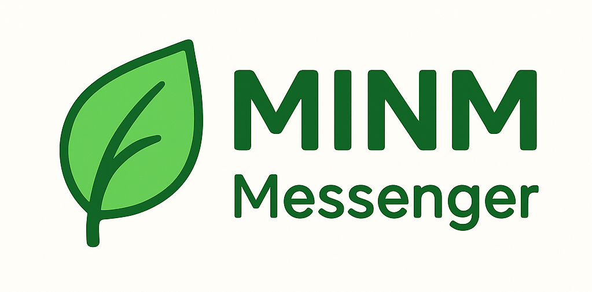

A linux messenger application built with C++ and Qt.

## Building

### Prerequisites

- CMake 3.16 or higher
- Qt6 (Core, Widgets, Gui)
- C++20 compatible compiler

### Quick Start

```bash
git clone https://github.com/Nikki-kun/MINM.git
cd MINM

make install

make run
```

### Make Commands

| Command | Description |
|---------|-------------|
| `make install` | Install all dependencies (apt packages + flask) |
| `make build` | Build project in build directory |
| `make run` | Build and run project |
| `make test` | Run test server |
| `make docs` | Generate documentation via Doxygen |
| `make clean` | Remove build and docs/html directories |
| `make rebuild` | Full project rebuild |
| `make rerun` | Full rebuild and run |
| `make help` | Show all available commands |

The executable will be created in the `build` directory.

## Generating Documentation

### Prerequisites

- Doxygen
- Graphviz (optional, for diagram generation)

### Generating Documentation

To generate HTML documentation using Doxygen:

```bash
make docs
```

### Documentation Location

The generated HTML documentation will be located in the `docs/html/` directory. You can open `docs/html/index.html` in any web browser to browse the documentation.

### Documentation Configuration

The project includes a `Doxyfile` configuration file that sets up:
- Source code parsing from `src/` directory
- HTML output to `docs/html/`
- Class diagrams and inheritance graphs (if Graphviz is installed)
